## 移动端适配方案——flexible.js

#### 1 介绍原理
‌flexible.js是一个由‌淘宝前端团队开发的JavaScript库，主要用于适配移动端设备。 
它的核心原理是根据不同的视口宽度动态调整网页中html根节点的font-size，从而实现网页内容的自适应显示。 
通过配合使用‌rem单位，flexible.js可以帮助开发者实现网页元素尺寸在不同宽度设备中的等比缩放效果。‌ 

###### 1.1 什么是rem？
rem是css的一个单位，其根据根元素的font-size大小设置rem的大小，1rem=1font-size。即可通过改变font-size改变rem，适用于屏幕适应。

###### 1.2 flexible.js原理
flexible.js是用来使内容适应屏幕大小的插件。 
原理是通过 js 动态修改根元素的 font-size 大小，设置1rem等于可视窗口的多少。 
下图为部分源代码，表示设置font-size为窗口（1920px）的10分之一，即192px。
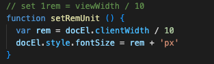

#### 2 使用方法
###### 2.1 下载flexible.js
下载flexible.js。可以从‌GitHub上下载flexible.js库，地址：https://github.com/amfe/lib-flexible
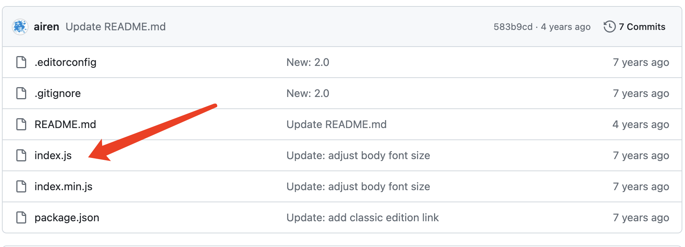

###### 2.2 引入flexible.js
引入flexible.js。将下载的flexible.js文件放在项目的适当位置，并在HTML文件的head部分引入脚本文件。‌
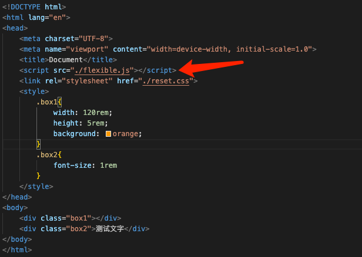

###### 2.3 确认设计稿大小
为了方便测量，需要提前确认UI美工设计稿大小，动态调整计算根元素html的font-size值。flexible.js中配置如下：
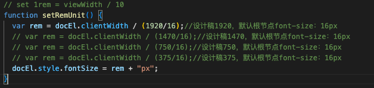

###### 2.4 下载vscode扩展自动计算px和rem
px to rem & rpx & vw (cssrem)  
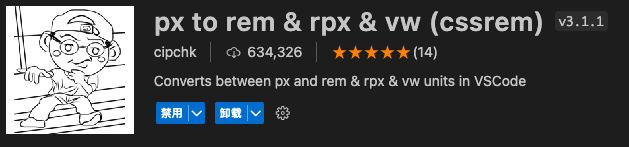

查看插件扩展设置中的root font size值为16。（设置1rem=16px）  
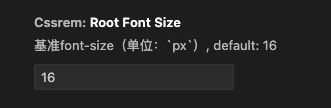

该值需要和flexible.js中设计稿计算公式保持一致即可。  
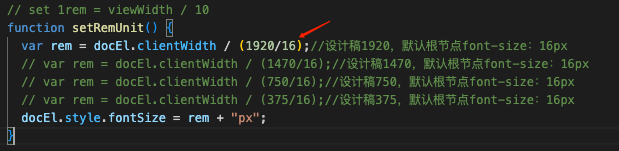

插件效果  
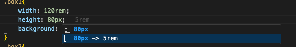

#### 3 测试使用
如：UI设计稿为1920px,flexible.js中采用1920px的计算公式。 
box1元素在设计稿中宽高为1920px和80px,通过vscode插件则自动计算为120rem和5rem。 
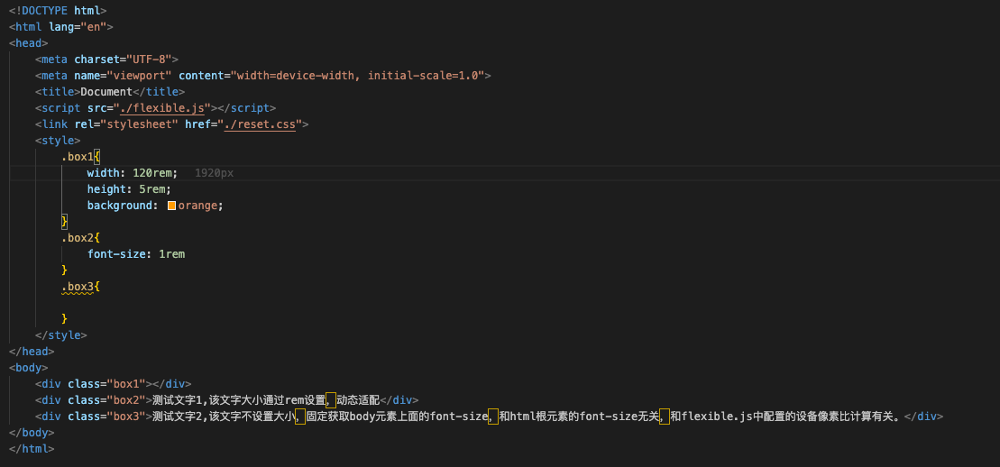

在1920分辨率的显示设备上，宽高为1920px、80px 
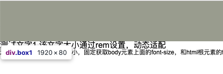

在375分辨的显示器设备上，宽高为375px、15.63px 
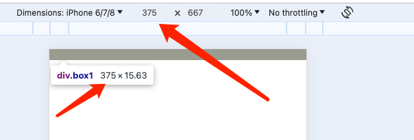

#### 4 其他移动端适配方案
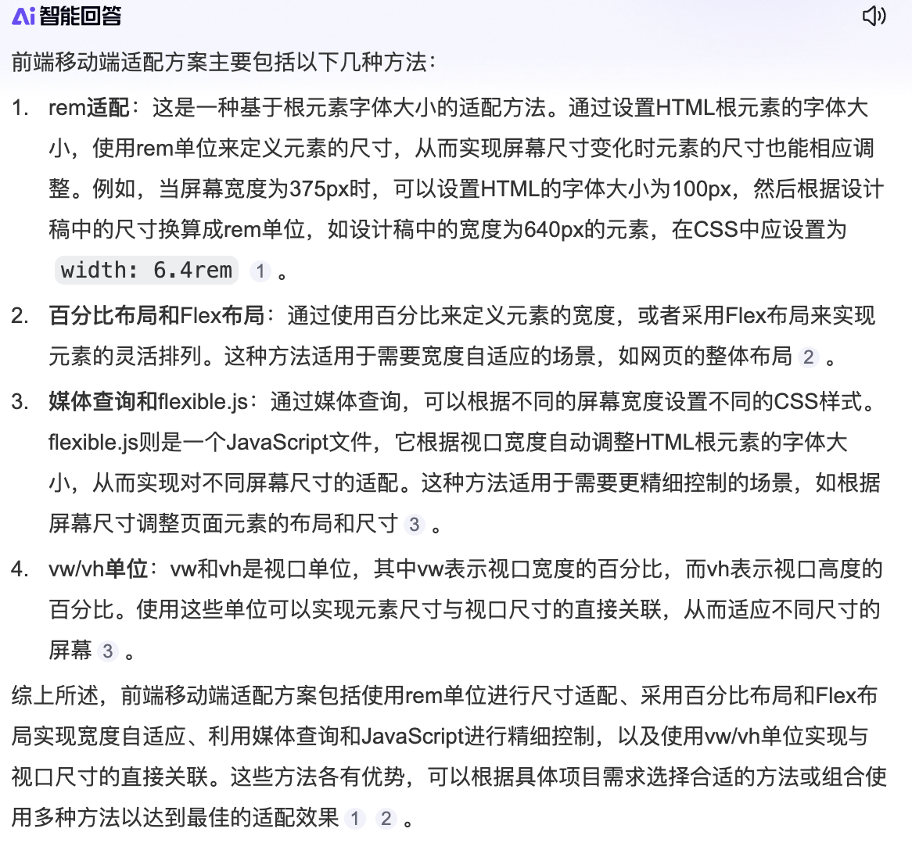
